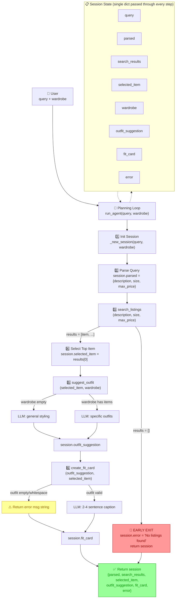

# FitFindr — planning.md

> Complete this document before writing any implementation code.
> Your spec and agent diagram are what you'll use to direct AI tools (Claude, Copilot, etc.) to generate your implementation — the more specific they are, the more useful the generated code will be.
> Your planning.md will be reviewed as part of your submission.
> Update it before starting any stretch features.

---

## Tools

List every tool your agent will use. For each tool, fill in all four fields.
You must have at least 3 tools. The three required tools are listed — add any additional tools below them.

### Tool 1: search_listings

**What it does:**
Searches the mock secondhand listings for items that match a natural-language description, with optional filtering by size and maximum price. It scores each listing by keyword overlap with the description, drops irrelevant results (score of 0), and returns matches sorted from best to worst.

**Input parameters:**

- `description` (str): Keywords describing what the user is looking for (e.g., `"vintage graphic tee"`). The tool splits this into tokens and checks how many appear in each listing's title, description, and style_tags.
- `size` (str | None): A size string to filter by, or `None` to skip size filtering. Matching is case-insensitive and partial — `"M"` matches a listing whose size field contains `"M"` anywhere (e.g., `"S/M"`).
- `max_price` (float | None): A maximum price ceiling (inclusive), or `None` to skip price filtering. Listings with `price <= max_price` are kept.

**What it returns:**
A `list[dict]` — each dict is a listing with these exact fields:

- `id` (str): unique listing ID like `"lst_001"`
- `title` (str): short name like `"Y2K Baby Tee — Butterfly Print"`
- `description` (str): 1–2 sentence item description
- `category` (str): `"tops"`, `"bottoms"`, `"outerwear"`, `"shoes"`, or `"accessories"`
- `style_tags` (list[str]): e.g., `["y2k", "vintage", "graphic tee"]`
- `size` (str): size string like `"S/M"` or `"W30 L30"`
- `condition` (str): `"excellent"`, `"good"`, or `"fair"`
- `price` (float): price in dollars (e.g., `18.00`)
- `colors` (list[str]): e.g., `["white", "pink"]`
- `brand` (str | None): brand name or `null`
- `platform` (str): `"depop"`, `"thredUp"`, or `"poshmark"`

The list is sorted by relevance score descending (best match first). Returns an empty list `[]` if nothing matches — never raises an exception.

**What happens if it fails or returns nothing:**
The tool itself returns `[]` without erroring. The **agent** (in the planning loop) checks `if not session["search_results"]:` after the call. If the list is empty, the agent sets `session["error"]` to a message like `"Sorry — no listings matched 'vintage graphic tee' under $30. Try a broader description or a higher budget."` and returns the session immediately. `suggest_outfit` and `create_fit_card` are never called with empty input.

---

### Tool 2: suggest_outfit

**What it does:**
Takes a selected thrifted item and the user's wardrobe, then uses the LLM (Groq) to generate outfit suggestions. If the wardrobe has items, it asks the LLM to build specific outfit combinations using named pieces from the wardrobe. If the wardrobe is empty, it asks the LLM for general styling advice — what pairings, vibes, and occasions suit the item.

**Input parameters:**

- `new_item` (dict): A single listing dict (the item the user is considering). Must include at minimum `title`, `category`, `colors`, `style_tags`, `price`, and `platform`.
- `wardrobe` (dict): A dict with an `items` key containing a list of wardrobe item dicts, each with: `id`, `name`, `category`, `colors`, `style_tags`, and optional `notes`. May have zero items (`{"items": []}`) — the tool handles this gracefully.

**What it returns:**
A `str` — a non-empty paragraph (2–5 sentences) of outfit advice. When the wardrobe has items, it reads like: `"Pair the [new_item title] with your [wardrobe piece name] for a [vibe] look. Layer with [another piece] and finish with [shoes]."` When the wardrobe is empty, it reads like: `"A [new_item title] works well with [general pairings]. It suits a [vibe] aesthetic and is great for [occasions]."` It never returns an empty string.

**What happens if it fails or returns nothing:**
The tool handles the empty-wardrobe case internally: it detects `wardrobe["items"]` is empty and pivots to a general-styling LLM prompt instead of a specific-outfit prompt. The agent does not need to branch here — `suggest_outfit` always returns a usable string. If the LLM call itself fails (API error, timeout), the tool returns a fallback string like `"Try pairing this with your favorite jeans and sneakers for an easy everyday look."` so the pipeline can continue to `create_fit_card`.

---

### Tool 3: create_fit_card

**What it does:**
Generates a short, shareable Instagram/TikTok-style caption for the thrifted find, combining the outfit suggestion from `suggest_outfit` with the item's listing details. The caption feels like a real OOTD post — casual, authentic, and varied across runs.

**Input parameters:**

- `outfit` (str): The outfit suggestion string returned by `suggest_outfit()`. May be empty or whitespace-only if the previous step produced nothing — the tool guards against this.
- `new_item` (dict): The same listing dict for the thrifted item. The tool reads `title`, `price`, `platform`, and `style_tags` from it to weave into the caption naturally.

**What it returns:**
A `str` — a 2–4 sentence caption like: `"Found this vintage band tee on depop for $22 and had to grab it. Styled it with baggy jeans and chunky sneakers for that effortless 90s energy. OOTD sorted. 🖤"` The caption mentions the item name, price, and platform once each, describes the outfit vibe in specific terms, and varies across runs (the LLM is called with higher temperature).

**What happens if it fails or returns nothing:**
The tool checks `if not outfit or not outfit.strip():` at the top. If the outfit string is empty, it returns a descriptive error message string: `"Couldn't generate a fit card — the outfit suggestion was empty."` It never raises an exception. The agent does not need to check the return value — whatever string comes back is stored in `session["fit_card"]` and displayed to the user.

---

### Additional Tools (if any)

<!-- Copy the block above for any tools beyond the required three -->

---

## Planning Loop

The agent follows a fixed sequence. There is exactly one conditional branch that changes the outcome — everything else is a straight line. Write `run_agent()` by walking through this list in order.

---

**1. Create the session.**

Call `session = _new_session(query, wardrobe)`. This gives you a dict with every field initialized: `parsed={}`, `search_results=[]`, `selected_item=None`, `outfit_suggestion=None`, `fit_card=None`, `error=None`.

**2. Parse the user's query into structured parameters.**

Take the raw `query` string and pull out three values:

- `description` — the item keywords the user is hunting for. This is everything that isn't a size or a price. For `"vintage graphic tee under $30 size M"`, the description is `"vintage graphic tee"`.
- `size` — if the user mentions a size (e.g., `"size M"`, `"medium"`, `"S/M"`), set this to that string. If no size is mentioned, set it to `None`.
- `max_price` — if the user names a dollar amount (e.g., `"under $30"`, `"max $25"`, `"cheaper than 40"`), set this to that number as a `float`. If no price is mentioned, set it to `None`.

Store the result: `session["parsed"] = {"description": description, "size": size, "max_price": max_price}`.

You can do this with regex (grab `\$(\d+)` for price, `size\s+(\S+)` for size, remove those substrings and trim the rest for description) or by asking the LLM to return a JSON object with those three keys.

**Chosen approach: regex** (implemented as `_parse_query()` in [agent.py](agent.py)). Regex was chosen over an LLM call because parsing is fully deterministic, needs no network/API key, adds zero latency, and the downstream `search_listings` only needs a bag of keyword tokens — it does not need a polished sentence. The parser:

- **`max_price`** — first looks for a price cue (`under`, `below`, `max`, `less than`, `cheaper than`, `<`) followed by a number, then falls back to a bare `$NN` amount. The matched span is removed from the query.
- **`size`** — looks for `size <token>` (e.g., `size M`, `size S/M`, `size XXS`); if absent, matches a word-based size (`small`→`S`, `medium`→`M`, `extra large`→`XL`, longest phrase first). The matched span is removed.
- **`description`** — whatever text remains, lowercased and split into tokens, with a small filler set removed (`looking`, `for`, `a`, `the`, `i'm`, `want`, `mostly`, etc.) so only meaningful keywords reach `search_listings`. For `"looking for a vintage graphic tee under $30"` this yields `"vintage graphic tee"`.

**3. Call `search_listings` and branch on the result.**

```python
session["search_results"] = search_listings(
    description=session["parsed"]["description"],
    size=session["parsed"]["size"],
    max_price=session["parsed"]["max_price"],
)
```

**Now check the result.** This is the only branch the agent loop itself makes:

- **If `session["search_results"]` is empty** (an empty list `[]`):

  ```python
  session["error"] = (
      f"Sorry — no listings matched '{session['parsed']['description']}'"
      + (f" under ${session['parsed']['max_price']:.0f}" if session["parsed"]["max_price"] else "")
      + ". Try a broader description or a higher budget."
  )
  return session
  ```

  The interaction ends here. `suggest_outfit` and `create_fit_card` are never called, and `session["outfit_suggestion"]` and `session["fit_card"]` stay `None`. The Gradio UI sees `session["error"]` is not `None` and displays that message.

- **If `session["search_results"]` is not empty**, continue to step 4.

**4. Pick the top result.**

```python
session["selected_item"] = session["search_results"][0]
```

The list is already sorted by relevance (best match first), so index `[0]` is the top match. No decision needed — always take the first one.

**5. Call `suggest_outfit`.**

```python
session["outfit_suggestion"] = suggest_outfit(
    new_item=session["selected_item"],
    wardrobe=session["wardrobe"],
)
```

The agent does not branch here. `suggest_outfit` handles both cases internally: if `wardrobe["items"]` is empty, it asks the LLM for general styling advice; if the wardrobe has items, it asks for specific outfit combinations using those named pieces. Either way, a non-empty string comes back, and the agent passes it along.

**6. Call `create_fit_card`.**

```python
session["fit_card"] = create_fit_card(
    outfit=session["outfit_suggestion"],
    new_item=session["selected_item"],
)
```

The agent does not branch here either. `create_fit_card` checks internally whether the outfit string is empty or whitespace-only: if so, it returns an error message string (`"Couldn't generate a fit card — the outfit suggestion was empty."`); if not, it calls the LLM for a 2–4 sentence caption. Whatever string comes back goes into `session["fit_card"]`.

**7. Return the session.**

```python
return session
```

You're done. The caller (Gradio UI) reads `session["error"]` first — if it's not `None`, the UI shows the error. Otherwise it displays `session["selected_item"]` (the listing card), `session["outfit_suggestion"]`, and `session["fit_card"]`.

---

**Summary: every decision and who makes it.**

| #   | Decision                             | Who checks it                | If true                                                            | If false                                            |
| --- | ------------------------------------ | ---------------------------- | ------------------------------------------------------------------ | --------------------------------------------------- |
| 3   | `search_results` is empty?           | **Agent loop**               | Set `error`, `return` early. Outfit and fit card are never called. | Continue to step 4.                                 |
| 5   | `wardrobe["items"]` is empty?        | **Inside `suggest_outfit`**  | Ask LLM for general styling advice.                                | Ask LLM for specific outfits using wardrobe pieces. |
| 6   | `outfit` string is empty/whitespace? | **Inside `create_fit_card`** | Return error message string.                                       | Call LLM for OOTD caption.                          |

---

## State Management

**How does information from one tool get passed to the next?**

All state for a single interaction lives in **one `session` dict**, created by `_new_session(query, wardrobe)` in [agent.py](agent.py) and threaded through every step of `run_agent()`. There are no globals and no hidden state — each step reads the fields it needs from `session` and writes its result back into `session`, so the dict is the single source of truth and the complete record of what happened.

**Fields tracked (initialized up front so every key always exists):**

| Field               | Set by                     | Type           | Purpose                                                                                 |
| ------------------- | -------------------------- | -------------- | --------------------------------------------------------------------------------------- |
| `query`             | `_new_session`             | `str`          | The original, unmodified user request.                                                  |
| `parsed`            | Step 2 (`_parse_query`)    | `dict`         | `{"description", "size", "max_price"}` — the inputs to `search_listings`.               |
| `search_results`    | Step 3 (`search_listings`) | `list[dict]`   | All matching listings, best match first.                                                |
| `selected_item`     | Step 4                     | `dict \| None` | `search_results[0]` — the listing fed into both `suggest_outfit` and `create_fit_card`. |
| `wardrobe`          | `_new_session`             | `dict`         | The user's wardrobe (`{"items": [...]}`), passed straight into `suggest_outfit`.        |
| `outfit_suggestion` | Step 5 (`suggest_outfit`)  | `str \| None`  | Outfit advice; becomes the `outfit` argument to `create_fit_card`.                      |
| `fit_card`          | Step 6 (`create_fit_card`) | `str \| None`  | The shareable caption.                                                                  |
| `error`             | Step 3 (on empty results)  | `str \| None`  | Set only on early exit; `None` on the success path.                                     |

**How data flows between tools:** the output of one tool is stored in `session` and then read as the input to the next — `parsed` → `search_listings` → `search_results` → `selected_item` → `suggest_outfit` → `outfit_suggestion` → `create_fit_card` → `fit_card`. The `selected_item` dict is reused as the `new_item` argument for both LLM tools, and `wardrobe` is read directly from the session rather than passed around separately.

**How the caller reads it:** `run_agent` returns the same `session` dict. The caller checks `session["error"]` first — if it is not `None`, the interaction ended early (at Step 3) and `outfit_suggestion`/`fit_card` remain `None`. Otherwise all three output fields are populated and ready to display.

---

## Error Handling

For each tool, describe the specific failure mode you're handling and what the agent does in response.

| Tool            | Failure mode                          | What the tool does                                                                                                                                                                                                                                                                                              | What the agent does with it                                                                                                                                                                                                                                                                                                                                                                                               | What the user sees                                                                                                                                                                                                                                  |
| --------------- | ------------------------------------- | --------------------------------------------------------------------------------------------------------------------------------------------------------------------------------------------------------------------------------------------------------------------------------------------------------------- | ------------------------------------------------------------------------------------------------------------------------------------------------------------------------------------------------------------------------------------------------------------------------------------------------------------------------------------------------------------------------------------------------------------------------- | --------------------------------------------------------------------------------------------------------------------------------------------------------------------------------------------------------------------------------------------------- |
| search_listings | No results match the query            | Returns `[]` — the empty list. Does not raise an exception.                                                                                                                                                                                                                                                     | Checks `if not session["search_results"]:` after the call. Sets `session["error"] = "Sorry — no listings matched 'vintage graphic tee' under $30. Try a broader description or a higher budget."` and returns the session immediately. `suggest_outfit` and `create_fit_card` are never called.                                                                                                                           | The Gradio UI sees `session["error"]` is not `None` and displays the error message in the first panel. The other two panels are blank — the user gets a clear failure with a concrete next step ("try a broader description or a higher budget").   |
| suggest_outfit  | Wardrobe is empty                     | Detects `wardrobe["items"]` is empty. Instead of erroring, it builds a different LLM prompt: "The user doesn't have any wardrobe items yet. Suggest general pairings and vibes for this piece — what kinds of bottoms, shoes, and layers would work with it?" Returns the LLM's response as a non-empty string. | Does not branch. The agent calls `suggest_outfit` and stores whatever string comes back into `session["outfit_suggestion"]`, then passes it to `create_fit_card` as usual. If the LLM call itself fails (API error, timeout), the tool catches the exception and returns the fallback string `"Try pairing this with your favorite jeans and sneakers for an easy everyday look."` — the agent stores that and continues. | The outfit panel shows general styling advice rather than specific wardrobe piece names. It still feels helpful: "A vintage graphic tee pairs well with relaxed denim and chunky sneakers for a 90s streetwear vibe." The fit card still generates. |
| create_fit_card | Outfit input is missing or incomplete | Checks `if not outfit or not outfit.strip():` at the top. Returns `"Couldn't generate a fit card — the outfit suggestion was empty."` immediately — no LLM call, no exception.                                                                                                                                  | Does not branch. The agent calls `create_fit_card` and stores whatever string comes back into `session["fit_card"]`. If the outfit was empty, that string is the error message.                                                                                                                                                                                                                                           | The fit card panel displays the error message: `"Couldn't generate a fit card — the outfit suggestion was empty."` The listing and outfit panels still show their content — only the fit card is affected.                                          |

---

## Architecture



**How to read this diagram:**

- **Solid arrows (→)** show the flow of execution — each step feeds into the next.
- **Dotted lines (- - →)** show that the Planning Loop reads from and writes to the Session State throughout.
- **Red nodes** are hard failures that terminate the interaction early (the user gets an error message instead of a fit card).
- **Yellow nodes** are soft guards inside tools that swap in a fallback so the pipeline can continue.
- **Green node** is the successful return — the session dict with all fields populated.

The only path that skips `suggest_outfit` and `create_fit_card` is when `search_listings` returns zero results. Every other error is handled inside the tool that encounters it, so the pipeline always reaches the return statement.

---

## AI Tool Plan

### Milestone 3 — Individual tool implementations

---

#### 3a: `search_listings()` in [tools.py](tools.py)

**AI tool:** Claude

**What I'll give it as input:**

- The **Tool 1: search_listings** block from this planning.md (inputs, return value with all 11 listing fields, failure mode)
- The **Error Handling** table row for `search_listings`
- The `search_listings()` function signature and docstring already in [tools.py:39-73](tools.py#L39) (it has the implementation steps spelled out in the TODO)
- The path to the data loader: `from utils.data_loader import load_listings` — the AI should call `load_listings()` to get all 40 listings
- The first listing from [data/listings.json](data/listings.json#L1-L14) as an example of the dict shape

**What I expect it to produce:**
A working `search_listings()` function that:

1. Calls `load_listings()` to get all listings
2. Filters by `max_price` (`price <= max_price`) if `max_price` is not `None`
3. Filters by `size` (case-insensitive substring match) if `size` is not `None`
4. Tokenizes `description` into lowercase keywords, then scores each listing by counting how many of those keywords appear in the listing's `title`, `description`, and `style_tags` (as a flat string)
5. Drops listings with a score of 0
6. Sorts descending by score and returns the list (not just scores — the full listing dicts)
7. Returns `[]` (not an exception) when nothing matches

**How I'll verify it before using it:**
Test it directly in a Python shell against 3 queries, checking both the happy path and the empty-results path:

| Test                     | Call                                                 | What I expect                                                                       |
| ------------------------ | ---------------------------------------------------- | ----------------------------------------------------------------------------------- |
| Happy path — broad match | `search_listings("vintage graphic tee", None, 30.0)` | A non-empty list, first item is the best vintage+graphic+tee match, all items ≤ $30 |
| Filter by size           | `search_listings("jeans", "W30", None)`              | Only listings whose `size` field contains `"W30"` (case-insensitive)                |
| No results               | `search_listings("designer ballgown", "XXS", 5.0)`   | `[]` — empty list, no exception                                                     |

I'll also spot-check that returned items are sorted by relevance (the best match should be first) and that every item in the result has all 11 fields listed in the spec.

---

#### 3b: `suggest_outfit()` in [tools.py](tools.py)

**AI tool:** Claude

**What I'll give it as input:**

- The **Tool 2: suggest_outfit** block from this planning.md (both wardrobe-present and wardrobe-empty paths, input/output types, fallback string)
- The **Error Handling** table row for `suggest_outfit`
- The `suggest_outfit()` function signature and docstring in [tools.py:78-104](tools.py#L78)
- The `_get_groq_client()` helper already in [tools.py:27-34](tools.py#L27) — the AI should use it to get an LLM client
- The wardrobe schema from [data/wardrobe_schema.json](data/wardrobe_schema.json#L1-L15) so it knows the fields on each wardrobe item (`name`, `category`, `colors`, `style_tags`, `notes`)
- A sample listing dict (from the search_listings spec) so it knows the fields on `new_item`

**What I expect it to produce:**
A working `suggest_outfit()` function that:

1. Checks `if not wardrobe["items"]:` to detect the empty wardrobe case
2. **If wardrobe is empty:** builds a prompt asking the LLM for general styling advice — what kinds of items pair well with the new item, what vibe it suits, what occasions it works for. Does NOT hallucinate specific wardrobe pieces the user doesn't own.
3. **If wardrobe has items:** formats each wardrobe piece (name, category, colors, style_tags, notes) into a bullet list, then builds a prompt asking the LLM to suggest 1–2 specific outfit combinations using the new item and named wardrobe pieces
4. Calls the Groq LLM via `_get_groq_client()` (e.g., `client.chat.completions.create(model="llama-3.3-70b-versatile", messages=[...])`)
5. Returns the LLM's response text as a string — never an empty string
6. Wraps the LLM call in a `try/except` — if the API fails (network error, auth error, timeout), returns a hardcoded fallback string like `"Try pairing this with your favorite jeans and sneakers for an easy everyday look."`

**How I'll verify it before using it:**
Test both branches directly:

| Test               | Setup                                                     | What I expect                                                                                  |
| ------------------ | --------------------------------------------------------- | ---------------------------------------------------------------------------------------------- |
| Wardrobe has items | Pass a real listing dict + `get_example_wardrobe()`       | Returns a non-empty string that mentions at least one specific wardrobe piece by name          |
| Wardrobe empty     | Pass a real listing dict + `get_empty_wardrobe()`         | Returns a non-empty string with general styling advice — does NOT name specific wardrobe items |
| LLM fails          | Temporarily unset `GROQ_API_KEY` or mock a failing client | Returns the hardcoded fallback string — does not raise an exception                            |

I'll run each test from a Python shell and read the output to confirm it's sensible, non-empty, and matches the branch it's supposed to hit.

---

#### 3c: `create_fit_card()` in [tools.py](tools.py)

**AI tool:** Claude

**What I'll give it as input:**

- The **Tool 3: create_fit_card** block from this planning.md (guard check, caption style guidelines, temperature note)
- The **Error Handling** table row for `create_fit_card`
- The `create_fit_card()` function signature and docstring in [tools.py:109-137](tools.py#L109)
- The `_get_groq_client()` helper again
- The example caption from the **A Complete Interaction** section so the AI sees the target tone

**What I expect it to produce:**
A working `create_fit_card()` function that:

1. Guards at the top: `if not outfit or not outfit.strip(): return "Couldn't generate a fit card — the outfit suggestion was empty."`
2. Extracts `title`, `price`, `platform`, and `style_tags` from `new_item`
3. Builds a prompt that includes: the item details, the outfit text, and explicit instructions to write a 2–4 sentence Instagram/TikTok caption that mentions the item name, price, and platform naturally (once each), describes the vibe in specific terms, and sounds casual/authentic (not like a product listing)
4. Calls the LLM with a higher-than-default temperature (e.g., `temperature=1.0`) so captions vary across runs
5. Returns the LLM's response text

**How I'll verify it before using it:**
Test it directly:

| Test               | Input                                             | What I expect                                                                                                                      |
| ------------------ | ------------------------------------------------- | ---------------------------------------------------------------------------------------------------------------------------------- |
| Happy path         | Real outfit string + real listing dict            | 2–4 sentence caption mentioning the item name, price, and platform at least once each                                              |
| Empty outfit guard | `outfit=""` or `outfit="   "` + real listing dict | Returns the exact error message string `"Couldn't generate a fit card — the outfit suggestion was empty."` — does NOT call the LLM |
| Variation check    | Same inputs, two calls                            | Two noticeably different captions (higher temperature working)                                                                     |

I'll verify by running the function and reading the output strings — the guard case should complete instantly (no LLM call), and the happy path should produce natural-sounding, non-repetitive captions.

---

### Milestone 4 — Planning loop and state management

---

#### 4a: `run_agent()` in [agent.py](agent.py)

**AI tool:** Claude (or Copilot / ChatGPT)

**What I'll give it as input:**

- The entire **Planning Loop** section from this planning.md — the 7 numbered steps, the exact Python pseudocode, the explicit if/else branch, and the summary table
- The **State Management** section (once filled in — explains the session dict)
- The **Architecture** Mermaid diagram (visual reference for how tools and state connect)
- The **Error Handling** table (all three rows)
- The `run_agent()` function signature and TODO docstring already in [agent.py:50-98](agent.py#L50) — it has the step-by-step plan in comments
- The import line already at the top of agent.py: `from tools import search_listings, suggest_outfit, create_fit_card`

**What I expect it to produce:**
A working `run_agent()` function that walks through the 7 steps exactly as described in the Planning Loop section — specifically:

1. Calls `_new_session(query, wardrobe)`
2. Parses the query (regex or LLM) and stores `session["parsed"]`
3. Calls `search_listings()` and stores `session["search_results"]`
4. **Branches:** if `search_results` is empty, sets `session["error"]` and returns the session immediately (no further tool calls)
5. Sets `session["selected_item"] = session["search_results"][0]`
6. Calls `suggest_outfit()` and stores `session["outfit_suggestion"]`
7. Calls `create_fit_card()` and stores `session["fit_card"]`
8. Returns `session`

**How I'll verify it before using it:**
Run the built-in CLI tests at the bottom of [agent.py](agent.py) (`python agent.py`):

| Path            | Query                                                              | Expected behavior                                                                                               |
| --------------- | ------------------------------------------------------------------ | --------------------------------------------------------------------------------------------------------------- |
| Happy path      | `"looking for a vintage graphic tee under $30"` + example wardrobe | `session["error"]` is `None`, `session["fit_card"]` is a non-empty string, `session["selected_item"]` is a dict |
| No-results path | `"designer ballgown size XXS under $5"` + example wardrobe         | `session["error"]` is a non-empty string, `session["outfit_suggestion"]` and `session["fit_card"]` are `None`   |

I'll also add a third manual test: pass `get_empty_wardrobe()` with a valid query to confirm `suggest_outfit` still returns a non-empty string (general styling branch) and the pipeline doesn't break.

---

#### 4b: `handle_query()` in [app.py](app.py)

**AI tool:** Claude (or Copilot / ChatGPT)

**What I'll give it as input:**

- The `handle_query()` function signature and TODO docstring in [app.py:23-47](app.py#L23)
- The Planning Loop section (so it knows `run_agent()` returns a session dict)
- The session dict field names from `_new_session()` in [agent.py:26-45](agent.py#L26)
- The list of example wardrobe items (names only — for the listing_text format)

**What I expect it to produce:**
A working `handle_query()` function that:

1. Guards against an empty `user_query` (`if not user_query.strip(): return "Please enter a search query.", "", ""`)
2. Selects the wardrobe: `get_example_wardrobe()` if `wardrobe_choice == "Example wardrobe"`, otherwise `get_empty_wardrobe()`
3. Calls `run_agent(user_query, wardrobe)` to get the session dict
4. If `session["error"]` is not `None`: returns `(session["error"], "", "")` — the error message in the first panel, nothing in the other two
5. Otherwise: formats `session["selected_item"]` into a readable string (title, price, platform, size, condition, description, a line for each) and returns `(listing_text, session["outfit_suggestion"], session["fit_card"])`

**How I'll verify it before using it:**
Launch the app with `python app.py` and test through the Gradio UI:

| Test           | Action                                                                    | What I expect to see                                                                            |
| -------------- | ------------------------------------------------------------------------- | ----------------------------------------------------------------------------------------------- |
| Happy path     | Type `"vintage graphic tee under $30"` + Example wardrobe → click Find it | All three panels populated: listing card, outfit idea, fit card caption                         |
| No results     | Click the "designer ballgown size XXS under $5" example                   | First panel shows the error message, other two panels are empty                                 |
| Empty query    | Click Find it with an empty search box                                    | First panel shows "Please enter a search query."                                                |
| Empty wardrobe | Type `"graphic tee under $30"` + Empty wardrobe → click Find it           | Outfit panel shows general styling advice (not specific wardrobe pieces), fit card is generated |

I'll also confirm the fit cards from two different queries read differently — not the same template with words swapped.

---

## A Complete Interaction (Step by Step)

FitFindr is a secondhand-shopping assistant that takes a user's natural-language query, searches a marketplace of thrifted clothing listings, and returns a complete styling recommendation. The agent parses the user's request to extract what they're looking for, then calls `search_listings` to find matching items — if nothing matches, it stops and tells the user so. When results are found, it picks the best match and feeds it into `suggest_outfit` to generate outfit ideas (using the user's existing wardrobe when available, or offering general styling advice when the wardrobe is empty), then wraps everything into a social-media-style fit card via `create_fit_card` so the user walks away with a concrete, shareable OOTD.

**Example user query:** "I'm looking for a vintage graphic tee under $30. I mostly wear baggy jeans and chunky sneakers. What's out there and how would I style it?"

---

**Step 1 — Parse the query.**

The agent pulls structured parameters from the raw query string:

```python
session["parsed"] = {
    "description": "vintage graphic tee",   # everything that isn't a size or a price
    "size": None,                           # no size mentioned in the query
    "max_price": 30.0,                      # extracted from "under $30"
}
```

---

**Step 2 — search_listings is called.**

Exact call:

```python
session["search_results"] = search_listings(
    description="vintage graphic tee",
    size=None,
    max_price=30.0,
)
```

What the tool does internally:

1. Calls `load_listings()` → receives all 40 listing dicts
2. Drops any listing with `price > 30.0` (removes listings priced $32–$75)
3. Skips size filter since `size is None`
4. Tokenizes `"vintage graphic tee"` → keywords: `["vintage", "graphic", "tee"]`
5. Scores each remaining listing by counting how many of those three keywords appear in the listing's `title`, `description`, and `style_tags` combined
6. Drops listings with score 0 (e.g., a plain white button-down wouldn't match any keyword)
7. Sorts by score descending and returns the matching listing dicts

What it returns — a list of 3 matching listings:

```python
[
    {
        "id": "lst_012",
        "title": "Vintage Band Tee — The Smiths 1987 Tour",
        "description": "Authentic vintage tour tee. Faded graphic, no holes. Tagged medium.",
        "category": "tops",
        "style_tags": ["vintage", "graphic tee", "band", "90s", "grunge"],
        "size": "M",
        "condition": "good",
        "price": 22.00,
        "colors": ["black", "white"],
        "brand": None,
        "platform": "depop",
    },
    {
        "id": "lst_018",
        "title": "Retro Graphic Tee — Sunset Print",
        "description": "Soft cotton tee with retro sunset graphic. Relaxed fit.",
        "category": "tops",
        "style_tags": ["graphic tee", "retro", "streetwear"],
        "size": "L",
        "condition": "excellent",
        "price": 18.00,
        "colors": ["orange", "yellow"],
        "brand": None,
        "platform": "poshmark",
    },
    {
        "id": "lst_025",
        "title": "Washed Logo Tee — Faded Print",
        "description": "Oversized logo tee with intentional fading. Distressed collar.",
        "category": "tops",
        "style_tags": ["graphic tee", "oversized", "streetwear", "vintage"],
        "size": "S/M",
        "condition": "good",
        "price": 25.00,
        "colors": ["grey", "white"],
        "brand": None,
        "platform": "thredUp",
    },
]
```

**Failure path — if search returned nothing:**

```python
if not session["search_results"]:
    session["error"] = (
        "Sorry — no listings matched 'vintage graphic tee' under $30. "
        "Try a broader description or a higher budget."
    )
    return session    # ← exits here. Steps 3–6 are skipped entirely.
```

The user would see: the error message in the first panel, blank panels for outfit and fit card. There is nothing to style yet, so the agent doesn't try.

---

**Step 3 — The agent picks the top result.**

```python
session["selected_item"] = session["search_results"][0]
```

This is the Vintage Band Tee ($22, depop) — it had the highest score because `"vintage"`, `"graphic tee"`, `"band"`, and `"grunge"` all overlapped with the query keywords. No decision logic — always index `[0]`.

---

**Step 4 — suggest_outfit is called.**

Exact call:

```python
session["outfit_suggestion"] = suggest_outfit(
    new_item=session["selected_item"],   # the Vintage Band Tee dict
    wardrobe=user_wardrobe,              # contains baggy jeans + chunky sneakers
)
```

What the tool does internally:

1. Checks `wardrobe["items"]` — it's not empty (contains `"Baggy straight-leg jeans, dark wash"` and `"Chunky white sneakers"` and 8 other items)
2. Builds an LLM prompt listing every wardrobe piece by name, category, colors, and style_tags
3. Asks the LLM: "Suggest 1–2 outfits pairing the Vintage Band Tee with items from this wardrobe. Name specific pieces."
4. Calls Groq and returns the response

What it returns — a single string:

```
Pair the Vintage Band Tee with your baggy straight-leg jeans for a relaxed
90s-grunge silhouette. Layer with the vintage black denim jacket if it's
cool out, and finish with the chunky white sneakers to keep it streetwear.
The black crossbody bag ties it all together.
```

**Failure path — if wardrobe were empty:**
The tool would detect `wardrobe["items"]` is empty and ask the LLM: "The user doesn't own any items yet. Suggest general pairings and vibes for a vintage band tee — what kinds of bottoms, shoes, and layers complement it?" The agent doesn't branch — it stores whatever string comes back and continues to Step 5.

---

**Step 5 — create_fit_card is called.**

Exact call:

```python
session["fit_card"] = create_fit_card(
    outfit=session["outfit_suggestion"],   # the string from Step 4
    new_item=session["selected_item"],     # the Vintage Band Tee dict
)
```

What the tool does internally:

1. Checks `if not outfit or not outfit.strip():` — the outfit string is non-empty, so the guard passes
2. Extracts `title="Vintage Band Tee — The Smiths 1987 Tour"`, `price=22.00`, `platform="depop"`, `style_tags=["vintage", "graphic tee", "band", "90s", "grunge"]`
3. Builds an LLM prompt with those details plus the outfit text, with instructions: "Write a 2–4 sentence Instagram/TikTok caption. Mention the item name, price ($22), and platform (depop) naturally. Capture the 90s-grunge vibe. Sound like a real person, not an ad."
4. Calls Groq with `temperature=1.0`

What it returns — a single string:

```
Found this vintage Smiths tour tee on depop for $22 and it's everything.
Styled it with baggy jeans and chunky sneakers for that effortless 90s
grunge energy. The faded graphic gives it so much character — OOTD sorted. 🖤
```

**Failure path — if outfit were empty:**
The guard at the top catches it: `return "Couldn't generate a fit card — the outfit suggestion was empty."` No LLM call is made. The agent stores that error string as `session["fit_card"]` and returns the session. The user sees the error message in the fit card panel, but the listing and outfit panels are unaffected.

---

**Step 6 — The agent returns the session.**

```python
return session
```

Final session state:

```python
{
    "query":              "I'm looking for a vintage graphic tee under $30...",
    "parsed":             {"description": "vintage graphic tee", "size": None, "max_price": 30.0},
    "search_results":     [ ... 3 listing dicts ... ],
    "selected_item":      { ... Vintage Band Tee dict, $22, depop ... },
    "wardrobe":           { "items": [ ... 10 wardrobe items ... ] },
    "outfit_suggestion":  "Pair the Vintage Band Tee with your baggy straight-leg jeans...",
    "fit_card":           "Found this vintage Smiths tour tee on depop for $22...",
    "error":              None,
}
```

---

**What the user actually sees in the Gradio UI:**

| Panel                    | Content                                                                                                                                                                                                                                                                                         |
| ------------------------ | ----------------------------------------------------------------------------------------------------------------------------------------------------------------------------------------------------------------------------------------------------------------------------------------------- |
| 🛍️ **Top listing found** | `Vintage Band Tee — The Smiths 1987 Tour`<br>`Price: $22.00  •  Platform: depop`<br>`Size: M  •  Condition: good`<br>`Category: tops  •  Style: vintage, graphic tee, band, 90s, grunge`<br>`Colors: black, white`<br><br>`Authentic vintage tour tee. Faded graphic, no holes. Tagged medium.` |
| 👗 **Outfit idea**       | `Pair the Vintage Band Tee with your baggy straight-leg jeans for a relaxed 90s-grunge silhouette. Layer with the vintage black denim jacket if it's cool out, and finish with the chunky white sneakers to keep it streetwear. The black crossbody bag ties it all together.`                  |
| ✨ **Your fit card**     | `Found this vintage Smiths tour tee on depop for $22 and it's everything. Styled it with baggy jeans and chunky sneakers for that effortless 90s grunge energy. The faded graphic gives it so much character — OOTD sorted. 🖤`                                                                 |

The user walks away with: the item they asked about, a specific outfit built from their actual wardrobe, and a shareable caption — all from one natural-language query.
